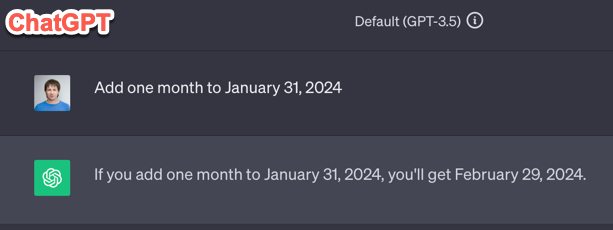

# Add Month

I recently tried to see how various common programming languages, along with their standard framework, handle a basic task: adding one month to a given date. This is generally straightforward, but there's a tricky situation. When you add a month to January 1st, you get February 1st, which is simple. But what about January 31st? What should happen when you add a month to it: should you get February 28 (or 29 for a leap year) or March 3rd (2nd for a leap year)?

While this can vary, it's clear to me that when you add one month, you should get a date in the next month. Any overflowing days should be disregarded. To ensure the date is valid (for example, February 31st doesn't exist), the closest valid date from the next month should be returned, which is typically the last day of that month.

Just to double-check and make sure, I discussed this with ChatGPT, and we both agree: adding one month to January 31st should give you February 29th, 2024, as the result.

So, in essence, adding one month isn't the same as adding 30 or 31 days. But are the standard libraries in different programming languages following this logic consistently? I investigated, and the answer is NO, they are not. I tested 7 programming languages and their libraries: C#.NET, Golang, PHP, Python, JS, Java, and Ruby. It turns out that three out of these 7 have an incorrect way of adding a month. Golang, PHP, and JS give you March 2nd instead of February 29th.

> [!NOTE]
> *Declaimer.* I'm not an expert in all the languages I tested. The code was written with the assistance of ChatGPT, so there might be alternative implementations of the month-adding function in the language or framework. Additionally, the implementation could be intentional, as I believe is the case with JavaScript. If there is another correct implementation available in the standard library for a given language, please let me know by creating a pull request.

Below you can find  the code snippets you used for the experiment, along with links to live code snippets (if available) and screenshots of the code and output.

## C#.NET
- 👍January 31, 2024 + 1 month = February 29, 2024
- [Code Sample](add-month-dotnet.cs)
- [Playground](https://dotnetfiddle.net/)
- [Screenshot](images/golang.png)

## Golang
- 👎 January 31, 2024 + 1 month = March 2, 2024
- [Code Sample](add-month-golang.go)
- [Live Snippet](https://goplay.tools/snippet/_rIZ2wGtRPN)
- [Screenshot](images/golang.png)

## PHP
- 👎 January 31, 2024 + 1 month = March 2, 2024
- [Code Sample](add-month-php.php)
- [Live Snippet](https://www.tehplayground.com/K7erQkjnyZ04rfBI)
- [Screenshot](images/php.png)

## Python
- 👍 January 31, 2024 + 1 month = February 29, 2024
- [Code Sample](add-month-python.py)
- [Live Snippet](https://www.online-python.com/XtEGBWSowF)
- [Screenshot](images/python.png)

## JS
- 👎 January 31, 2024 + 1 month = March 2, 2024
- [Code Sample](add-month-js.js)
- [Playground](https://playcode.io/javascript)
- [Screenshot](images/js.png)

## Java
- 👍 January 31, 2024 + 1 month = February 29, 2024
- [Code Sample](add-month-java.java)
- [Playground](https://www.sololearn.com/compiler-playground/java)
- [Screenshot](images/java.png)

## Ruby
- 👍 January 31, 2024 + 1 month = February 29, 2024
- [Code Sample](add-month-ruby.py)
- Playground: https://www.jdoodle.com/execute-ruby-online
- [Screenshot](images/ruby.png)

## ChatGPT
- 👍 January 31, 2024 + 1 month = February 29, 2024
- [Screenshot](images/chat-gpt.png)
